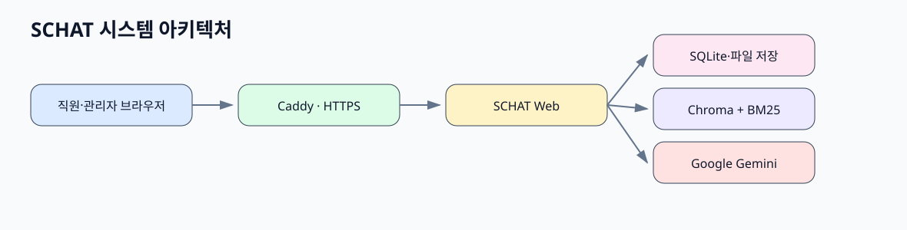
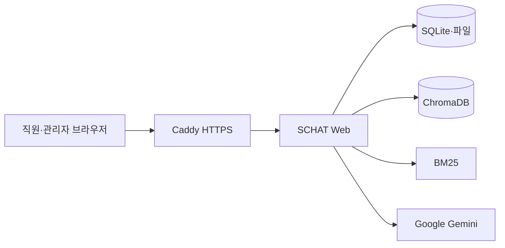
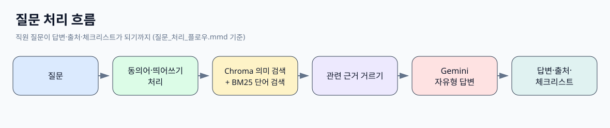
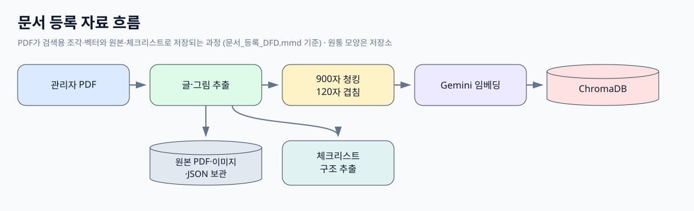
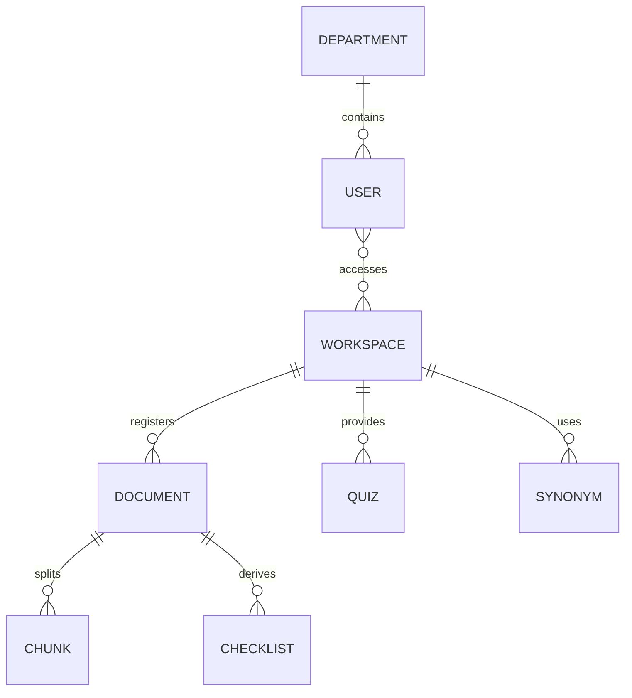

# 산출물 형식 샘플

## 시스템 아키텍처 구조도

> 이 그림은 직원 브라우저의 질문이 어떤 서버와 외부 서비스를 거치는지 보여줍니다.

## 질문 처리 플로우차트

> 이 그림은 질문을 받은 뒤 답변·출처·체크리스트를 보여주기까지의 순서를 설명합니다.

## 자료 흐름도(DFD)

> 이 그림은 PDF가 검색 자료로 바뀌고 저장되는 과정을 보여줍니다.

## 저장 구조도(ERD)

> 이 그림은 사용자·부서·문서·조각·체크리스트·퀴즈·동의어가 어떻게 연결되는지 보여줍니다.

## 어떤 형식이 보기 좋은가요?

| 형식 | 장점 | 단점 | 추천 용도 |
|---|---|---|---|
| 아키텍처 | 전체 시스템을 한 장에 이해 | 세부 순서는 약함 | 발표 첫 장 |
| 플로우차트 | 질문 처리 순서가 분명 | 저장 관계는 약함 | 개발·테스트 설명 |
| DFD | 자료가 어디로 움직이는지 명확 | 화면 기능 설명은 약함 | 문서 등록 설명 |
| ERD | 저장 관계와 책임을 정확히 표현 | 비개발자에게 다소 어려움 | 설계·인수인계 |

**표준 형식 선택 상태: 선택 대기.** 발표에는 아키텍처+플로우차트, 개발 인수인계에는 DFD+ERD 조합을 권합니다.
