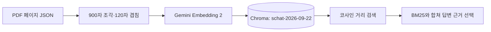

# Chroma 컬렉션 설계서

## 한눈에 보기

## 컬렉션

- 실제 workspace slug: `schat-2026-09-22`
- Chroma collection은 namespace를 정규화해 만들며 현재 workspace 이름과 같습니다.
- 코드: `server/utils/vectorDbProviders/chroma/index.js`

| 칸 이름 | 쉬운 설명 | 예시 값 | 이 칸을 쓰는 기능 |
|---|---|---|---|
| `id` | 조각 하나의 고유번호 | UUID | 중복 방지·삭제·정답 비교 |
| `document`/`text` | 검색할 조각 내용 | 지침 원문 일부 | 의미 검색·단어 검색 |
| `embedding` | 글을 숫자로 바꾼 값 | 3,072차원 배열 | 의미 검색 |
| `id` | 메타데이터 | `fbb30279-85de-4ac9-b239-d028964db113` | 검색·출처·문서 연결 |
| `document_id` | 메타데이터 | `2dd13a76-3ffe-4660-84fa-45511664a3d2` | 검색·출처·문서 연결 |
| `url` | 메타데이터 | `file:///app/collector/hotdir/2026실무지침서 (26.7).pdf` | 검색·출처·문서 연결 |
| `title` | 메타데이터 | `2026실무지침서 (26.7).pdf` | 검색·출처·문서 연결 |
| `docAuthor` | 메타데이터 | `Hwp 2022 12.0.0.3650` | 검색·출처·문서 연결 |
| `description` | 메타데이터 | `No description found.` | 검색·출처·문서 연결 |
| `docSource` | 메타데이터 | `pdf file uploaded by the user.` | 검색·출처·문서 연결 |
| `chunkSource` | 메타데이터 | `` | 검색·출처·문서 연결 |
| `usage_scope` | 메타데이터 | `employee` | 검색·출처·문서 연결 |
| `document_version` | 메타데이터 | `` | 검색·출처·문서 연결 |
| `page` | 메타데이터 | `1` | 검색·출처·문서 연결 |
| `section` | 메타데이터 | `개요` | 검색·출처·문서 연결 |
| `published` | 메타데이터 | `unknown` | 검색·출처·문서 연결 |
| `wordCount` | 메타데이터 | `8` | 검색·출처·문서 연결 |
| `token_count_estimate` | 메타데이터 | `38` | 검색·출처·문서 연결 |
| `text` | 메타데이터 | `순천향대학교 천안병원 간호부
2026년    실무 지침서` | 검색·출처·문서 연결 |
| `related_image_keys` | 메타데이터 | `["f9a1f4931154c98b77f7c9ceba3fc392bc7c51b5528d09a7304ca40dba` | 검색·출처·문서 연결 |

## 기능 ↔ 저장 칸

| 기능 | 사용하는 칸 |
|---|---|
| 출처에 파일명 표시 | `title` |
| 출처에 쪽수 표시 | `page` |
| 원본 PDF 연결 | `document_id` → 공개 `pdfRef` |
| 항목명·목차 표시 | `section` |
| 본문/이미지 설명 구분 | `content_type` |
| 관련 이미지 열기 | `image_key` |
| 문서 버전 구분 | `document_version` |

## 거리 계산 방식

- `server/utils/vectorDbProviders/chroma/index.js:473`, `:623`에서 collection metadata를 `{"hnsw:space":"cosine"}`으로 설정합니다.
- 즉 두 글의 방향이 얼마나 비슷한지 보는 **코사인 거리**를 씁니다.

## 청킹 규칙

- 최대 크기: **900자** (`schatPolicy.js:1`)
- 앞뒤 겹침: **120자** (`schatPolicy.js:2`)
- PDF 페이지의 `pageContent`를 문단·구분자 기준으로 자르고 긴 부분만 900자 한도에서 나눕니다.
- `section`은 페이지의 목차/제목 후보에서 뽑아 metadata에 보존합니다.

## 현재 등록 문서와 버전

| 문서 | 등록 페이지 행 | `document_version` | document_id 수 |
|---|---:|---|---:|
| 2026실무지침서 (26.7).pdf | 461 | (비어 있음) | 1 |
| 검사 및 시술(26.04.07).pdf | 82 | (비어 있음) | 1 |

### 실제 확인 결론

현재 두 문서는 `document_version` 값이 비어 있고, 같은 제목의 1.0/1.1 쌍도 현재 workspace에 없습니다. 코드에는 `document_version`을 저장하지만 검색할 때 “최신 버전만” 거르는 조건은 없습니다. 따라서 같은 지침을 새 문서로 올리고 기존 문서를 지우지 않으면 **둘 다 검색될 가능성이 높습니다**.

### 2단계 제안

업로드 때 `document_family`와 정렬 가능한 `document_version`을 저장하고, 검색 직전에 family별 active 최신 document_id만 허용하는 filter를 적용합니다. 기존 문서는 관리자에게 최신 여부를 한 번 지정하게 하고, 자동 추측으로 옛 문서를 숨기지 않습니다.
